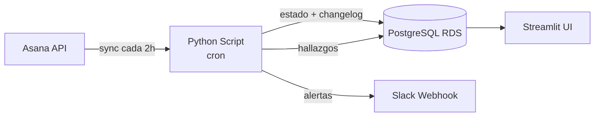
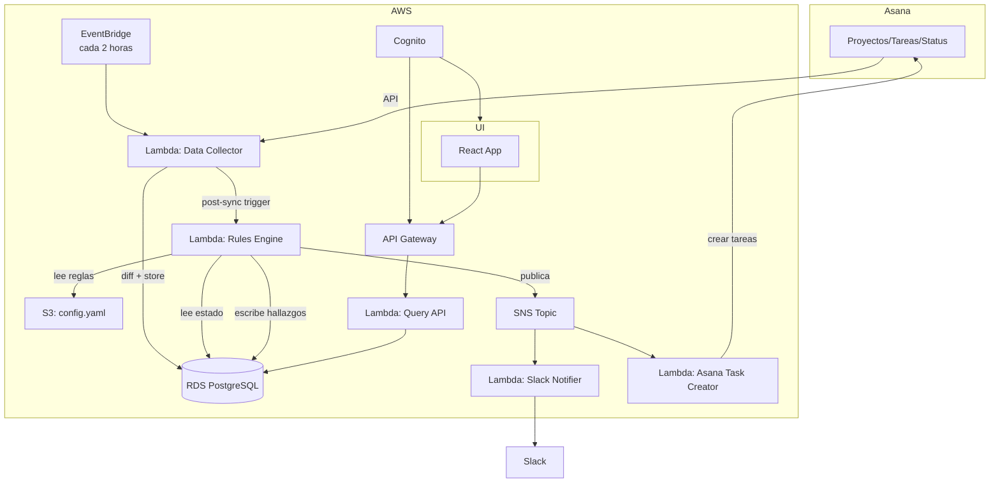

# PMO Control Tower — Propuesta de Arquitectura y Gobierno

**Versión:** 1.2  
**Fecha:** 2026-02-02  
**Estado:** MVP cerrado para implementación

---

## 1. Contexto y problemática

La organización gestiona más de 100 proyectos activos utilizando Asana como herramienta principal de seguimiento. Si bien Asana cubre adecuadamente la gestión operativa básica, **no provee capacidades suficientes de control PMO, detección temprana de riesgos ni mecanismos automáticos de enforcement**, lo que genera los siguientes problemas:

- Proyectos sin *Status Update* actualizado semanalmente.
- Proyectos con riesgo objetivo (por cronograma o avance) que no es reconocido ni gestionado por el Jefe de Proyecto (JP).
- Uso irregular de Asana como sistema de registro (proyectos sin actividad real).
- Falta de alertas tempranas y reportes consolidados orientados a la PMO.
- Dependencia excesiva de revisiones manuales para identificar incumplimientos.

El resultado es una **PMO reactiva**, con baja visibilidad temprana y escasa capacidad de control sistemático.

---

## 2. Objetivo general

Diseñar e implementar un **PMO Control Tower**, entendido como una capa externa de observación, análisis y acción, que permita:

- Supervisar objetivamente el estado de los proyectos.
- Detectar incumplimientos y riesgos de forma temprana.
- Generar alertas y acciones automáticas.
- Entregar una visión consolidada y auditable a la PMO.
- Mantener a Asana como sistema de ejecución, sin reemplazarlo.

---

## 3. Alcance

### 3.1 MVP (versión inicial — 2 semanas)

| Incluido | Excluido (v2+) |
|----------|----------------|
| Sincronización de proyectos desde Asana | Query Agent con lenguaje natural |
| Changelog de campos críticos con diff entre syncs (MVP) | Changelog completo (todos los campos) |
| 3 reglas PMO básicas funcionando | Escalamiento multinivel (más allá de PMO) |
| Alertas a Slack | Autenticación con Cognito |
| UI Streamlit para visualización | UI React profesional |
| Configuración en archivo YAML | Configuración desde UI |

### 3.2 Métricas de seguimiento (MVP)

- **Avance del proyecto:** Porcentaje de tareas completadas respecto de las tareas totales.
- **Fecha de término:** Referencia de cronograma desde Asana.
- **Status Update:** Mecanismo formal de actualización del JP.
- **Actividad real:** Basada en creación y cierre de tareas.

> **Nota:** La métrica de avance actual es simple y puede distorsionarse con scope creep. En versiones futuras se evaluará incorporar estimaciones ponderadas.

### 3.3 Exclusiones explícitas (todas las versiones)

- Medición de carga de trabajo individual.
- Integraciones con Clockify, GitHub u otras herramientas técnicas.

---

## 4. Principios de diseño

1. **Separación de responsabilidades**
   - Asana: ejecución y registro operativo.
   - Control Tower: control, análisis, alertas y gobierno PMO.

2. **Determinismo**
   - El cálculo de riesgo y los incumplimientos se basan en reglas explícitas y verificables.

3. **Auditabilidad**
   - Toda alerta debe poder explicarse por datos y reglas observables.
   - Historial de cambios **en campos críticos** (MVP) con autor y timestamp. Auditoría completa (todos los campos) opcional en v2+.

4. **No intrusividad**
   - El sistema no bloquea proyectos ni tareas.

5. **Configurabilidad**
   - Reglas, umbrales y destinatarios son configurables vía archivo YAML.

---

## 5. Arquitectura

### 5.1 Arquitectura MVP



**Decisiones de simplificación para MVP:**
- Sin Lambdas, SNS ni API Gateway.
- Script Python ejecutado por cron en EC2 (o local para validación).
- Streamlit conecta directamente a PostgreSQL.
- Autenticación básica (Streamlit built-in o ninguna en red interna).

### 5.2 Componentes MVP

| Componente | Tecnología | Descripción |
|------------|------------|-------------|
| **Data Collector** | Python + cron | Sincroniza proyectos desde Asana cada 2 horas, detecta cambios mediante diff |
| **Project Cache DB** | PostgreSQL RDS | Almacena estado actual, changelog histórico y hallazgos |
| **Rules Engine** | Python (mismo script) | Evalúa reglas post-sync, genera hallazgos |
| **Action Manager** | Slack Webhook | Envía alertas al canal dedicado |
| **Configuración** | `config.yaml` | Reglas, umbrales, destinatarios |
| **UI** | Streamlit | Visualización de proyectos, hallazgos y changelog |

### 5.3 Arquitectura futura (v2+)



---

## 6. Modelo de datos

### 6.1 Tablas principales

```sql
-- Estado actual de proyectos (cache sincronizado)
CREATE TABLE projects (
    gid VARCHAR(50) PRIMARY KEY,
    name VARCHAR(500) NOT NULL,
    owner_gid VARCHAR(50),
    owner_name VARCHAR(200),
    due_date DATE,
    status VARCHAR(20),              -- on_track, at_risk, off_track
    calculated_progress DECIMAL(5,2),
    is_billing_plan BOOLEAN DEFAULT FALSE,
    last_status_update_at TIMESTAMP,
    last_status_update_by VARCHAR(200),
    last_activity_at TIMESTAMP,
    total_tasks INTEGER,
    completed_tasks INTEGER,
    raw_data JSONB,                  -- dump completo de Asana
    synced_at TIMESTAMP NOT NULL,
    created_at TIMESTAMP DEFAULT NOW()
);

-- Historial de cambios (audit trail) — MVP: solo campos críticos; v2+: auditoría completa opcional
CREATE TABLE project_changelog (
    id SERIAL PRIMARY KEY,
    project_gid VARCHAR(50) NOT NULL,
    field_name VARCHAR(100) NOT NULL,
    old_value TEXT,
    new_value TEXT,
    changed_by_gid VARCHAR(50),
    changed_by_name VARCHAR(200),
    changed_at TIMESTAMP,            -- cuándo ocurrió en Asana
    detected_at TIMESTAMP NOT NULL,  -- cuándo lo detectó el sync
    sync_id VARCHAR(50),             -- identificador del sync que lo detectó
    FOREIGN KEY (project_gid) REFERENCES projects(gid)
);

-- Hallazgos del Rules Engine
CREATE TABLE findings (
    id SERIAL PRIMARY KEY,
    project_gid VARCHAR(50) NOT NULL,
    rule_id VARCHAR(50) NOT NULL,
    severity VARCHAR(20) NOT NULL,   -- low, medium, high
    status VARCHAR(20) NOT NULL,     -- open, acknowledged, resolved
    visibility_level VARCHAR(10),    -- JP, PMO (MVP). Niveles adicionales en v2+
    details JSONB,                   -- contexto adicional del hallazgo
    created_at TIMESTAMP DEFAULT NOW(),
    escalated_at TIMESTAMP,
    resolved_at TIMESTAMP,
    resolved_by VARCHAR(200),
    FOREIGN KEY (project_gid) REFERENCES projects(gid)
);

-- Registro de sincronizaciones
CREATE TABLE sync_log (
    id SERIAL PRIMARY KEY,
    sync_id VARCHAR(50) UNIQUE NOT NULL,
    started_at TIMESTAMP NOT NULL,
    completed_at TIMESTAMP,
    projects_synced INTEGER,
    changes_detected INTEGER,
    findings_created INTEGER,
    status VARCHAR(20),              -- running, completed, failed
    error_message TEXT
);
```

### 6.2 Índices recomendados

```sql
CREATE INDEX idx_changelog_project ON project_changelog(project_gid);
CREATE INDEX idx_changelog_detected ON project_changelog(detected_at);
CREATE INDEX idx_findings_project ON findings(project_gid);
CREATE INDEX idx_findings_status ON findings(status);
CREATE INDEX idx_findings_created ON findings(created_at);
CREATE INDEX idx_projects_billing ON projects(is_billing_plan) WHERE is_billing_plan = TRUE;
```

---

## 7. Reglas PMO

### 7.1 Reglas MVP

| ID | Regla | Condición | Severidad base |
|----|-------|-----------|----------------|
| `no_status_update` | Sin Status Update | >7 días sin actualización | Media |
| `no_activity` | Sin actividad | 0 tareas creadas/cerradas en 7 días | Media |
| `schedule_risk` | Riesgo cronograma | Días restantes vs avance (ver tabla) | Según tabla |

### 7.2 Tabla de riesgo por cronograma

| Días restantes | Avance mínimo requerido | Severidad si no cumple |
|----------------|-------------------------|------------------------|
| ≤7 | 80% | Alta |
| ≤14 | 60% | Media |
| ≤30 | 40% | Baja |

### 7.3 Modificador por plan de facturación

Los proyectos marcados como **plan de facturación** (custom field en Asana, pendiente de crear):
- Incrementan su severidad en +1 nivel automáticamente.
- Se destacan en reportes y alertas.

### 7.4 Archivo de configuración

```yaml
# config.yaml
asana:
  workspace_gid: "YOUR_WORKSPACE_GID"
  sync_interval_hours: 2
  
slack:
  webhook_url: "https://hooks.slack.com/services/XXX/YYY/ZZZ"
  channel: "#pmo-status"  # canal dedicado existente

database:
  host: "your-rds-endpoint.amazonaws.com"
  port: 5432
  name: "pmo_control_tower"
  
rules:
  no_status_update:
    enabled: true
    days_threshold: 7
    base_severity: medium
    
  no_activity:
    enabled: true
    days_threshold: 7
    base_severity: medium
    
  schedule_risk:
    enabled: true
    thresholds:
      - days_remaining: 7
        min_progress: 80
        severity: high
      - days_remaining: 14
        min_progress: 60
        severity: medium
      - days_remaining: 30
        min_progress: 40
        severity: low

billing_plan:
  custom_field_name: "Plan de Facturación"  # nombre exacto en Asana
  severity_boost: 1  # incrementa severidad en 1 nivel

escalation:
  enabled: false  # deshabilitado en MVP
  days_per_level: 3
  chain: [JP, PMO]  # MVP: PMO detiene todas las balas
  billing_only_escalates_to: [PMO]  # MVP
```

---

## 8. Mecanismo de visibilidad y escalamiento (MVP: JP → PMO)

### 8.1 Cadena (MVP)

```
JP → PMO
```

### 8.2 Reglas (v2+)

- Cualquier hallazgo no resuelto en **3 días** escala al siguiente nivel.
- En v2+ se puede extender la cadena de visibilidad/escalamiento a niveles adicionales (por ejemplo: Dirección), según gobierno interno.
- En MVP **toda escalación termina en PMO**.

### 8.3 Definición de "resuelto"

Un hallazgo se considera resuelto cuando:
- La condición que lo generó ya no se cumple (ej: JP publica Status Update).
- El sistema lo detecta automáticamente en el siguiente sync.

> **Nota:** En MVP no existe escalamiento multinivel: los hallazgos se registran, se notifican a JP/PMO y la PMO gestiona el seguimiento. La automatización de escalamiento a niveles adicionales queda para v2+.

---

## 9. Integración Slack

### 9.1 Formato de alertas

```
🔴 [ALTA] Proyecto "Migración SAP" - Riesgo por cronograma
├── JP: María González
├── Días restantes: 5
├── Avance: 45%
├── Plan de facturación: Sí
└── Ver en Asana: https://app.asana.com/0/PROJECT_GID

⚠️ [MEDIA] Proyecto "Portal Clientes" - Sin Status Update
├── JP: Carlos Ruiz
├── Último update: hace 12 días
└── Ver en Asana: https://app.asana.com/0/PROJECT_GID
```

### 9.2 Frecuencia de alertas

- Alertas se envían inmediatamente post-sync cuando se detectan nuevos hallazgos.
- No se re-envían alertas para hallazgos ya existentes (evitar spam).
- Resumen diario opcional (v2+).

---

## 10. Interfaz de usuario (Streamlit MVP)

### 10.1 Vistas principales

1. **Dashboard PMO**
   - Conteo de proyectos por estado de riesgo
   - Proyectos plan de facturación destacados
   - Hallazgos abiertos por severidad

2. **Lista de proyectos**
   - Grilla con todos los proyectos
   - Filtros: estado, JP, plan de facturación, riesgo calculado
   - Ordenamiento por columnas
   - Exportación a Excel

3. **Detalle de proyecto**
   - Estado actual
   - Historial de cambios (changelog)
   - Hallazgos asociados

4. **Lista de hallazgos**
   - Todos los hallazgos abiertos
   - Filtros por regla, severidad, proyecto
   - Acción manual para **acknowledge** (reconocer) un hallazgo, con comentario obligatorio (no borra historial)

### 10.2 Autenticación MVP

- Sin autenticación (red interna) o autenticación básica de Streamlit.
- Roles PMO_ADMIN / PMO_VIEWER diferidos a v2+.

---

## 11. Gobierno y control de acceso (v2+)

- Autenticación centralizada con AWS Cognito.
- Roles:
  - **PMO_ADMIN:** Configuración, override de hallazgos, acceso total.
  - **PMO_VIEWER:** Solo lectura.
- Los Jefes de Proyecto no acceden a la UI del Control Tower.

---

## 12. Plan de implementación MVP

### Semana 1: Data + Rules

| Día | Entregable |
|-----|------------|
| 1-2 | Conexión Asana API, modelo de datos en PostgreSQL, sync básico de proyectos |
| 3 | Diff entre syncs → changelog funcionando |
| 4-5 | Rules Engine: 3 reglas evaluando, guardando findings |

### Semana 2: Acciones + UI

| Día | Entregable |
|-----|------------|
| 6-7 | Integración Slack (webhook), alertas enviándose |
| 8-9 | Streamlit: dashboard, lista proyectos, lista hallazgos, filtros |
| 10 | Testing, ajustes, deploy en EC2 |

---

## 13. Stack técnico MVP

| Componente | Tecnología | Notas |
|------------|------------|-------|
| Lenguaje | Python 3.11 | |
| Sync | Script + cron | En EC2 t3.micro o local |
| Base de datos | RDS PostgreSQL | Retención indefinida |
| ORM/Queries | SQLAlchemy o psycopg2 | |
| Config | YAML | En repositorio |
| Alertas | Slack Incoming Webhook | Canal existente |
| UI | Streamlit | Mismo EC2 o Streamlit Cloud |
| Versionamiento | Git | |

---

## 14. Requisitos previos

- [ ] Token de API de Asana con permisos de lectura en workspace.
- [ ] Instancia RDS PostgreSQL (o crear nueva).
- [ ] Webhook de Slack configurado para canal `#pmo-status`.
- [ ] Custom field "Plan de Facturación" creado en Asana.
- [ ] EC2 para ejecutar sync y UI (o decisión de usar Streamlit Cloud).

---

## 15. Consideraciones y límites conocidos

- El porcentaje de avance depende de la calidad de la planificación inicial y puede distorsionarse con cambios de scope.
- El sistema no reemplaza la responsabilidad del JP.
- La efectividad mejora a medida que se corrigen hábitos de uso de Asana.
- El "quién hizo el cambio" está limitado a lo que expone la API de Asana (principalmente `modified_by` y autor de Status Update).
- Cambios que ocurran entre syncs (cada 2 horas) no se capturan individualmente.

---

## 16. Extensiones futuras (roadmap v2+)

| Feature | Descripción | Prioridad |
|---------|-------------|-----------|
| Escalamiento automático | Implementar escalamiento/visibilidad multinivel (más allá de PMO) con tiempos | Alta |
| Creación de tareas | Crear tareas automáticas al JP en Asana | Alta |
| Auth Cognito | Roles PMO_ADMIN/VIEWER | Media |
| Query Agent | Consultas en lenguaje natural | Media |
| UI React | Interfaz profesional | Media |
| Integración Clockify | Análisis de carga de trabajo | Baja |
| Modelos predictivos | Riesgo basado en histórico | Baja |
| Métricas de madurez PMO | Indicadores de mejora continua | Baja |

---

## 17. Conclusión

El PMO Control Tower permite evolucionar desde un seguimiento manual y reactivo hacia un modelo de **gobernanza activa, objetiva y auditable**, sin reemplazar Asana ni interferir con la operación diaria.

El enfoque MVP prioriza:
- Validar la utilidad de las reglas y datos con usuarios reales.
- Implementación rápida (2 semanas) con stack simple.
- Base sólida (modelo de datos, changelog) que soporta extensiones futuras.

---

## Anexo A: Campos auditados en changelog

En MVP se auditan **campos críticos PMO**. En v2+ se puede habilitar auditoría completa. Campos críticos recomendados:

| Campo | Fuente Asana | Notas |
|-------|--------------|-------|
| `name` | project.name | |
| `due_date` | project.due_date | |
| `status` | project.current_status.color | on_track, at_risk, off_track |
| `owner` | project.owner | |
| `is_billing_plan` | custom_field | Pendiente crear |
| `total_tasks` | calculado | Count de tareas |
| `completed_tasks` | calculado | Count de tareas completadas |
| `calculated_progress` | calculado | completed/total * 100 |
| `last_status_update_at` | status_update.created_at | |
| `last_status_update_by` | status_update.author | |

---

## Anexo B: API de Asana - Endpoints requeridos

```
GET /workspaces/{workspace_gid}/projects
GET /projects/{project_gid}
GET /projects/{project_gid}/tasks
GET /projects/{project_gid}/project_statuses
GET /users/{user_gid}
```

Scope requerido del token: `default` (lectura de proyectos, tareas, usuarios).

---

*Documento preparado para revisión técnica.*


---

## 18. Implementación asistida por IA (paso a paso con prompts)

**Objetivo:** guiar a una IA (o asistente técnico) para implementar el MVP completo, de forma incremental, reproducible y con control de calidad.

### 18.1 Contexto de desarrollo

- **Ruta local de trabajo (Windows):** `C:\MorrisFiles\Proyectos\ControlTower`
- **Repositorio GitHub (vacío):** `hgomez-morris/controltower`

> Recomendación: cada paso debe terminar con (a) código funcionando localmente, (b) commits pequeños y descriptivos, y (c) una nota breve en `CHANGELOG.md`.

---

### 18.2 Prompts sugeridos (ejecutar en orden)

#### Prompt 01 — Inicialización del repositorio y estructura base
**Prompt para IA:**
“Necesito inicializar un repositorio Python 3.11 para un proyecto llamado `controltower` en Windows.  
Ruta: `C:\MorrisFiles\Proyectos\ControlTower`.  
Repositorio remoto: `https://github.com/hgomez-morris/controltower` (está vacío).  
Crea la estructura recomendada (src layout), `pyproject.toml` (poetry o uv; elige uno y justifica), `.gitignore`, `README.md`, `CHANGELOG.md`, `Makefile` o `tasks.ps1` (Windows), y un `docs/` con este documento.  
Incluye comandos exactos para ejecutar en PowerShell, y deja el proyecto listo para correr `pytest`.”

**Criterio de aceptación:**
- `pytest` corre (aunque sea con un test vacío).
- `ruff`/`black` (o equivalente) configurados.
- Primer commit: `chore: bootstrap project structure`.

---

#### Prompt 02 — Configuración por entorno y secretos
**Prompt para IA:**
“Agrega soporte de configuración con `config.yaml` + variables de entorno (por ejemplo `ASANA_TOKEN`, `DATABASE_URL`, `SLACK_WEBHOOK_URL`).  
No hardcodear secretos.  
Incluye ejemplo `config.example.yaml` y `.env.example`.  
Define un módulo `config/` que valide la configuración al iniciar y falle con mensajes claros.”

**Criterio de aceptación:**
- Ejecutar `python -m controltower.config.check` valida configuración.
- Segundo commit: `chore: add config management`.

---

#### Prompt 03 — Modelo de datos y migraciones
**Prompt para IA:**
“Implementa el modelo de datos PostgreSQL del documento (tablas `projects`, `project_changelog`, `findings`, `sync_log`) usando SQLAlchemy 2.x.  
Para MVP, el changelog debe registrar **solo campos críticos** (name, due_date, owner, status, last_status_update_at/by, total_tasks, completed_tasks, calculated_progress).  
Agrega migraciones (Alembic) y un comando para crear/actualizar el esquema.”

**Criterio de aceptación:**
- `alembic upgrade head` crea tablas.
- Tercer commit: `feat: add db schema and migrations`.

---

#### Prompt 04 — Cliente Asana (lectura) y normalización
**Prompt para IA:**
“Crea un cliente de Asana solo-lectura. Implementa funciones:
- listar proyectos del workspace/portfolio
- obtener tareas de un proyecto (con estado completado y created_at/completed_at)
- obtener status updates del proyecto (último status update y autor)
Normaliza datos al esquema `projects`. Implementa rate limit básico y reintentos.”

**Criterio de aceptación:**
- Un script `scripts/smoke_asana.py` imprime 5 proyectos con campos clave.
- Cuarto commit: `feat: asana read client`.

---

#### Prompt 05 — Sincronización incremental + diff (MVP)
**Prompt para IA:**
“Implementa el `Data Collector` del MVP:
- sync cada 2 horas (manual por ahora)
- carga estado actual de proyectos
- calcula progreso como tareas completadas / total
- actualiza tabla `projects`
- genera diff solo de campos críticos y escribe en `project_changelog`
- registra en `sync_log`
Incluye logging estructurado.”

**Criterio de aceptación:**
- `python -m controltower.sync.run --once` ejecuta una sync completa.
- Quinto commit: `feat: incremental sync with critical-field changelog`.

---

#### Prompt 06 — Motor de reglas (3 reglas MVP)
**Prompt para IA:**
“Implementa `Rules Engine` con 3 reglas:
- `no_status_update`: >7 días sin status update
- `no_activity`: 0 tareas creadas y 0 tareas cerradas en 7 días
- `schedule_risk`: tabla (≤7/≤14/≤30 días vs avance mínimo)
Guardar hallazgos en `findings` con severidad y `visibility_level` (MVP: JP, PMO).  
Evita duplicar hallazgos: si un hallazgo ya existe abierto para el mismo project+rule, no crear otro.  
Define cómo se resuelve automáticamente cuando deja de cumplirse.”

**Criterio de aceptación:**
- Tras sync, se generan hallazgos coherentes.
- Sexto commit: `feat: rules engine and findings lifecycle`.

---

#### Prompt 07 — Notificador Slack (sin spam)
**Prompt para IA:**
“Implementa el `Action Manager` del MVP: enviar alertas a Slack vía webhook cuando se crean hallazgos nuevos.  
No reenviar hallazgos existentes.  
Formato de mensaje según documento (incluye JP, días restantes, avance, link Asana).  
Permite configurar canal y ‘modo dry-run’.”

**Criterio de aceptación:**
- Se envía 1 mensaje por hallazgo nuevo.
- Séptimo commit: `feat: slack notifications for new findings`.

---

#### Prompt 08 — UI Streamlit (Dashboard, Proyectos, Hallazgos)
**Prompt para IA:**
“Crea una UI Streamlit simple:
- Dashboard PMO (conteos por severidad, top proyectos)
- Lista de proyectos con filtros (JP, severidad calculada, plan facturación si existe)
- Lista de hallazgos abiertos con filtros
- Detalle de proyecto: estado + changelog crítico + hallazgos
Para la acción manual, no usar ‘resolved’ directo: implementar botón **Acknowledge** que cambia `status` a `acknowledged` y exige comentario obligatorio (guardar comentario en `details`).”

**Criterio de aceptación:**
- Streamlit corre local y permite navegar.
- Octavo commit: `feat: streamlit mvp ui`.

---

#### Prompt 09 — Empaquetado, jobs y operación local (Windows)
**Prompt para IA:**
“Agrega scripts para operación:
- `run_sync_once.ps1`
- `run_streamlit.ps1`
- `run_all_local.ps1` (sync + rules + slack en modo dry-run + UI)
Incluye documentación en README para levantar todo localmente.”

**Criterio de aceptación:**
- Un usuario puede clonar y ejecutar con instrucciones claras.
- Noveno commit: `docs: local ops scripts and runbook`.

---

#### Prompt 10 — Pruebas y calidad (mínimo)
**Prompt para IA:**
“Agrega pruebas mínimas:
- unit tests para reglas (casos borde)
- test de deduplicación de hallazgos
- test del cálculo de avance
Incluye `pytest` y mocks para Asana/Slack.”

**Criterio de aceptación:**
- CI local: `pytest` pasa.
- Décimo commit: `test: add basic unit tests for core logic`.

---

### 18.3 Checklist de cierre del MVP

- [ ] Sync incremental estable y auditable (campos críticos)
- [ ] 3 reglas MVP generando hallazgos consistentes
- [ ] Alertas Slack sin spam
- [ ] UI Streamlit usable por PMO
- [ ] Acknowledge con comentario (sin borrar historial)
- [ ] README + scripts Windows para correr local
- [ ] Logs y trazabilidad (sync_id)

